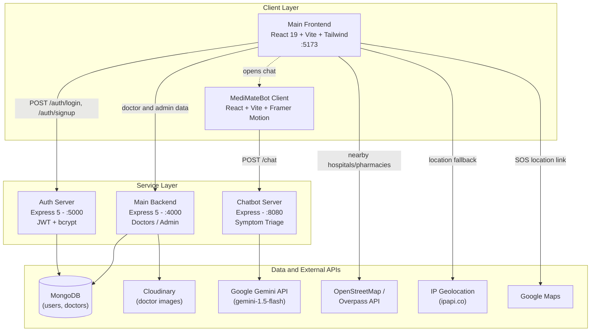
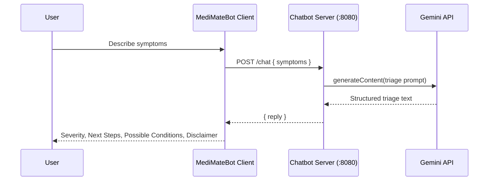
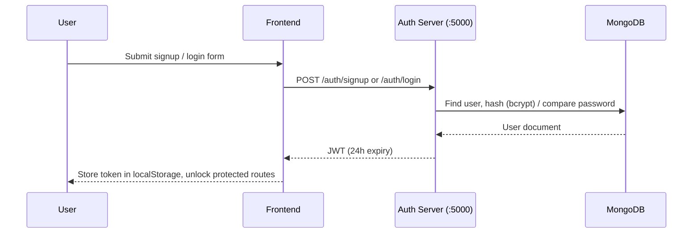
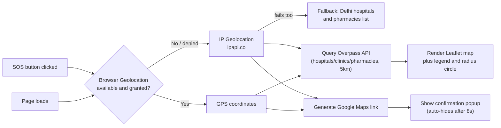

<div align="center">


### Your friendly AI health companion. Check symptoms, find care nearby, and navigate your health journey with confidence.

[](https://react.dev/)
[](https://vitejs.dev/)
[](https://tailwindcss.com/)
[](https://nodejs.org/)
[](https://expressjs.com/)
[](https://www.mongodb.com/)
[](https://ai.google.dev/)
[](https://leafletjs.com/)

</div>

---

## Table of Contents

- [What is MediMate?](#what-is-medimate)
- [Features](#features)
- [Architecture](#architecture)
- [Pipelines and Flows](#pipelines-and-flows)
- [Tech Stack](#tech-stack)
- [Project Structure](#project-structure)
- [Getting Started](#getting-started)
- [Environment Variables](#environment-variables)
- [Running the Project](#running-the-project)
- [Roadmap](#roadmap)
- [Team](#team)

---

## What is MediMate?

**MediMate** is an AI-powered medical assistant, built as a multi-service web app that helps users triage symptoms, locate nearby care, and manage their health journey, all through a friendly chatbot interface fronted by **Miffy**, the MediMate jellyfish mascot.

<div align="center">
<table>
<tr>
<td align="center" width="50%"></td>
<td align="center" width="50%"></td>
</tr>
</table>
</div>

---

## Features

#### AI-Powered Symptom Checker
- Built on **Google's Gemini API** for natural, context-aware medical conversations
- Analyzes user-reported symptoms and always replies in a structured format: **Severity**, **Immediate Need for Attention**, **See a Doctor If**, **Next Steps**, **Possible Conditions**
- Helps users decide whether they can manage symptoms at home or need to see a professional

#### Nearby Hospitals and Pharmacies
- Interactive map powered by **OpenStreetMap and the Overpass API**
- Auto-detects the user's **approximate location** via GPS, falling back to **IP geolocation**
- Displays hospitals, clinics, and pharmacies within a **5 km radius**, with a legend and radius circle for clarity
- Falls back to prominent Delhi hospitals (AIIMS, Safdarjung, Apollo, Fortis) and pharmacies (Apollo Pharmacy, MedPlus) if location detection fails entirely

#### Emergency SOS
- One-click emergency trigger available from the navbar on every page
- Detects location via GPS, falling back to IP-based lookup
- Shows a confirmation popup with a direct Google Maps link to the detected location
- Auto-dismisses after a few seconds for a smooth, non-intrusive UX

#### Doctor Directory and Appointment Booking
- Browse doctors by specialty, hospital, experience, rating, and consultation fee
- Pick a date and an open time slot, then confirm, with live appointment summaries

#### Patient Dashboard
- At-a-glance view of upcoming appointments, prescriptions, and test reports
- One click into the chatbot for a quick symptom check

#### Authentication
- Dedicated auth microservice with **JWT**-based sessions and **bcrypt**-hashed passwords
- Protected routes on the frontend redirect unauthenticated users to log in first

---

## Architecture

MediMate is composed of **two frontends** and **three independent backend services**, each owning its own concern (auth, core data, AI chat) and talking to its own set of external APIs.



| Service | Responsibility | Port | Data store |
|---|---|---|---|
| **Main Frontend** (`frontend/`) | Home, doctors, booking, dashboard, profile, SOS, map | `5173` | none |
| **MediMateBot Client** (`MediMateBot/client/`) | Standalone chat UI ("Miffy") | Vite dev port | none |
| **Main Backend** (`backend/`) | Doctor/admin data, image uploads | `4000` | MongoDB + Cloudinary |
| **Auth Server** (`backend/authServer/`) | Signup/login, JWT issuance | `5000` | MongoDB |
| **Chatbot Server** (`MediMateBot/server/`) | Symptom triage via Gemini | `8080` | none (stateless) |

---

## Pipelines and Flows

### Symptom Checker (Chatbot) Flow



### Authentication Flow



### Healthcare Locator and Emergency SOS Flow



---

## Tech Stack

| Layer | Technologies |
|---|---|
| **Frontend** | React 19, Vite, Tailwind CSS v4, React Router 7, Framer Motion, React-Leaflet, Axios, React Toastify, lucide-react |
| **Backend (core)** | Node.js, Express 5, Mongoose, Multer, Cloudinary |
| **Auth Service** | Node.js, Express 5, Mongoose, JWT, bcrypt, Joi |
| **Chatbot Service** | Node.js, Express, `@google/generative-ai` (Gemini) |
| **Database** | MongoDB |
| **Maps and Geo** | Leaflet, OpenStreetMap, Overpass API, ipapi.co |

---

## Project Structure

```
untitled folder/
├── frontend/                 # Main patient-facing app (React + Vite + Tailwind)
│   ├── src/pages/             # Home, Doctors, Dashboard, Book Appointment, ...
│   ├── src/authPage/          # Login, Signup
│   └── src/components/        # NavBar, Header, Footer
│
├── backend/                  # Core API (doctors, admin, Cloudinary uploads)
│   ├── authServer/            # Independent auth microservice (JWT + bcrypt)
│   ├── controllers/ routes/ models/
│   └── config/                # MongoDB and Cloudinary config
│
├── MediMateBot/               # Standalone AI chatbot ("Miffy")
│   ├── client/                 # Chat UI (React + Vite + Framer Motion)
│   └── server/                 # Gemini-powered triage API
│
└── MediMate_Team Zenith.pdf   # Project pitch deck
```

---

## Getting Started

Install dependencies for each service (they're independent Node projects):

```bash
# Chatbot backend
cd MediMateBot/server && npm install

# Chatbot frontend
cd MediMateBot/client && npm install

# Main frontend
cd frontend && npm install

# Auth backend
cd backend/authServer && npm install

# Main backend
cd backend && npm install
```

---

## Environment Variables

**`MediMateBot/server/.env`**
```env
GEMINI_API_KEY=your_google_api_key_here
```

**`backend/authServer/.env`**
```env
PORT=5000
MONGO_URI=your_mongoDB_URI
JWT_SECRET=your_jwt_secret_key
```

**`backend/.env`**
```env
PORT=4000
MONGODB_URI=your_mongoDB_URI
CLOUDINARY_NAME=your_cloudinary_name
CLOUDINARY_API_KEY=your_cloudinary_api_key
CLOUDINARY_SECRET_KEY=your_cloudinary_secret
```

---

## Running the Project

| Service | Command | URL |
|---|---|---|
| Chatbot backend | `cd MediMateBot/server && node server.js` | `http://localhost:8080` |
| Chatbot frontend | `cd MediMateBot/client && npm run dev` | printed by Vite |
| Main frontend | `cd frontend && npm run dev` | printed by Vite |
| Auth backend | `cd backend/authServer && npm run dev` | `http://localhost:5000` |
| Main backend | `cd backend && npm start` | `http://localhost:4000` |

Open the main frontend's printed local URL in your browser to use MediMate end-to-end.

---

## Roadmap

- [ ] Wire the Doctors/Booking pages to live data from the Main Backend (currently mock data)
- [ ] Complete the standalone `chatbot.jsx` page inside the main frontend (currently opens the bot client in a new tab)
- [ ] Flesh out the admin dashboard (`adminController`/`adminRoute`) beyond `add-doctor`
- [ ] Persist appointments, prescriptions, and test reports to MongoDB

---

## Team

Built for **Hack Imperium** by **Team Zenith**. See [`MediMate_Team Zenith.pdf`](MediMate_Team%20Zenith.pdf) for the full pitch.
