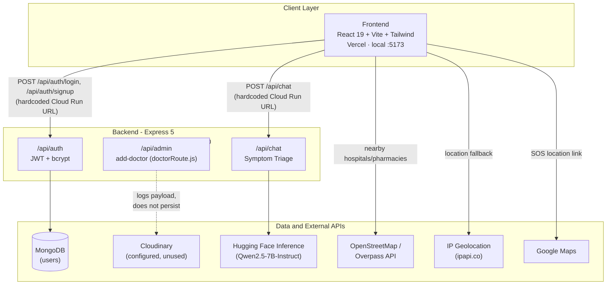
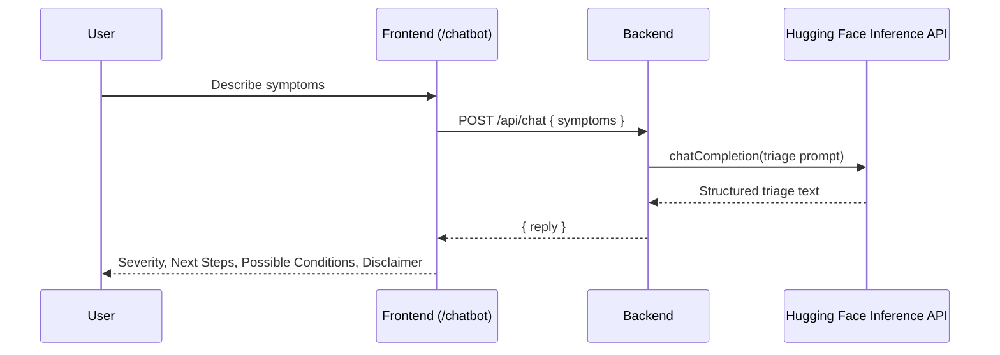
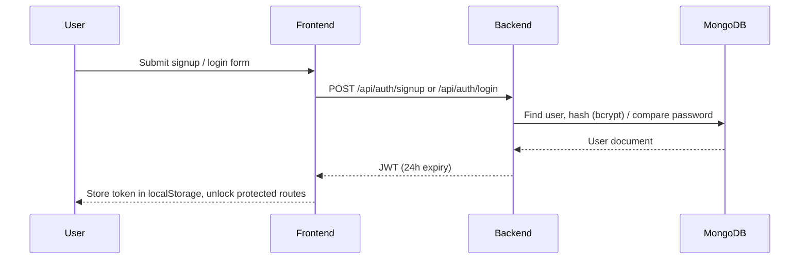
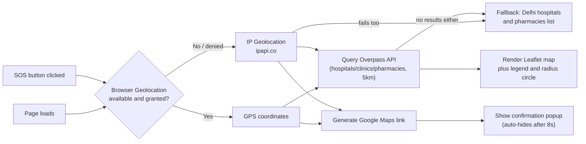
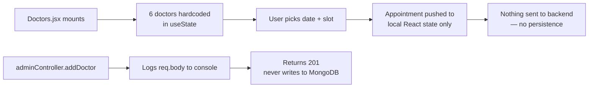

<div align="center">


### Your friendly AI health companion. Check symptoms, find care nearby, and navigate your health journey with confidence.

[](https://react.dev/)
[](https://vitejs.dev/)
[](https://tailwindcss.com/)
[](https://nodejs.org/)
[](https://expressjs.com/)
[](https://www.mongodb.com/)
[](https://huggingface.co/docs/inference-providers/index)
[](https://leafletjs.com/)
[](https://www.docker.com/)
[](https://vercel.com/)

</div>

---

## Table of Contents

- [What is MediMate?](#what-is-medimate)
- [Features](#features)
- [Architecture](#architecture)
- [Pipelines and Flows](#pipelines-and-flows)
- [Tech Stack](#tech-stack)
- [Project Structure](#project-structure)
- [Getting Started](#getting-started)
- [Environment Variables](#environment-variables)
- [Running the Project](#running-the-project)
- [Known Rough Edges](#known-rough-edges)
- [Roadmap](#roadmap)
- [Team](#team)

---

## What is MediMate?

**MediMate** is an AI-powered medical assistant that helps users triage symptoms, locate nearby care, and manage their health journey, all through a friendly chatbot interface fronted by **Miffy**, the MediMate jellyfish mascot.

<div align="center">
<table>
<tr>
<td align="center" width="50%"></td>
<td align="center" width="50%"></td>
</tr>
</table>
</div>

---

## Features

#### AI-Powered Symptom Checker
- Built on **Hugging Face Inference Providers** (`@huggingface/inference`, model `Qwen/Qwen2.5-7B-Instruct` by default) for natural, context-aware medical conversations
- Every reply is forced into a structured format: **Severity**, **Immediate Need for Attention**, **See a Doctor If**, **Next Steps**, **Possible Conditions**, **Disclaimer**
- Helps users decide whether they can manage symptoms at home or need to see a professional

#### Nearby Hospitals and Pharmacies
- Interactive map (embedded on the Home page) powered by **Leaflet + OpenStreetMap tiles** and the **Overpass API**
- Auto-detects the user's **GPS location**, falling back to **IP geolocation** (`ipapi.co`) if GPS is denied or unavailable
- Displays hospitals, clinics, and pharmacies within a **5 km radius**, with a legend, distance sort, and a radius circle for clarity
- Falls back to a hardcoded Delhi list (AIIMS, Safdarjung, Apollo, Fortis, Apollo Pharmacy, MedPlus) if both GPS and IP location fail, or if Overpass returns nothing

#### Emergency SOS
- One-click emergency trigger available from the navbar on every page
- Detects location via GPS, falling back to IP-based lookup
- Shows a confirmation popup with a direct Google Maps link to the detected location
- Auto-dismisses after 8 seconds for a smooth, non-intrusive UX

#### Doctor Directory and Appointment Booking
- Browse doctors by specialty, hospital, experience, rating, and consultation fee
- Pick a date and an open time slot, then confirm, with a live appointment summary
- **Currently entirely mock data held in component state** — nothing is persisted or fetched from the backend (see [Known Rough Edges](#known-rough-edges))

#### Patient Dashboard
- At-a-glance view of upcoming appointments, prescriptions, and test reports (also mock data, hardcoded in the component)
- One click into the chatbot for a quick symptom check

#### Authentication
- **JWT**-based sessions (24h expiry) and **bcrypt**-hashed passwords, validated with **Joi** and served from the unified backend
- Protected routes on the frontend (e.g. `/dashboard`) redirect unauthenticated users to `/login`
- Session persists in `localStorage`; a `RefreshHandler` re-hydrates auth state and bounces already-logged-in users off `/login`/`/signup`

---

## Architecture

MediMate is composed of **one frontend** and **one unified backend**. The backend used to be three separate Express services (core API, auth, chatbot); they've since been merged into a single Express app mounted under `/api/admin`, `/api/auth`, and `/api/chat`, so there's only one server to run and deploy. The chatbot UI was likewise a standalone app and is now just a page (`/chatbot`) inside the main frontend.

In production, the frontend is deployed to **Vercel** and the backend runs as a **Dockerized container on Google Cloud Run**. Note that the auth pages and chatbot page currently call the deployed Cloud Run URL directly (hardcoded, not an env variable) rather than a configurable API base URL — see [Known Rough Edges](#known-rough-edges).



| Service | Responsibility | Port (local) | Data store |
|---|---|---|---|
| **Frontend** (`frontend/`) | Home, doctors (mock), booking (mock), dashboard (mock), profile, SOS, map, chatbot | `5173` | none |
| **Backend** (`backend/`) | Auth (signup/login), chatbot proxy to Hugging Face, `add-doctor` stub | `4000` | MongoDB (users only) |

---

## Pipelines and Flows

### Symptom Checker (Chatbot) Flow



### Authentication Flow



### Healthcare Locator and Emergency SOS Flow



### Doctor Directory / Booking (mock-data reality check)



---

## Tech Stack

| Layer | Technologies |
|---|---|
| **Frontend** | React 19, Vite, Tailwind CSS v4, React Router 7, Framer Motion, React-Leaflet, React Toastify, lucide-react |
| **Backend** | Node.js, Express 5, Mongoose, Multer, Cloudinary SDK (configured, unused), JWT, bcrypt, Joi, `@huggingface/inference` |
| **Database** | MongoDB (stores `users` only — doctors are not persisted anywhere) |
| **Maps and Geo** | Leaflet, OpenStreetMap, Overpass API, ipapi.co |
| **Deployment** | Vercel (frontend, SPA rewrites via `vercel.json`), Docker + Google Cloud Run (backend) |

---

## Project Structure

```
untitled folder/
├── frontend/                    # Patient-facing app (React + Vite + Tailwind)
│   ├── src/pages/                 # home, Doctors, dashboard, bookappointment, chatbot ("Miffy"),
│   │                               # about, contact, Myprofile, Myappointments, Logintocontinue,
│   │                               # MapComponent (embedded in home, not a route)
│   │                               # testreports.jsx / prescriptions.jsx exist but are unrouted (dead code)
│   ├── src/authPage/               # Login, Signup (call the deployed backend directly)
│   ├── src/components/             # NavBar (nav + SOS), Header, Footer, FloatingShape
│   └── src/RefreshHandler.jsx       # Re-hydrates auth state from localStorage on route change
│
├── backend/                     # Single unified API (auth, chatbot, doctor stub)
│   ├── routes/                    # authRouter, chatRoute, doctorRoute (mounted as /api/admin)
│   │                               # adminRoute.js is empty and not imported anywhere
│   ├── controllers/                # authController, chatController, adminController
│   │                               # doctorController.js is empty and not imported anywhere
│   ├── models/                     # User.js (actually used by authController)
│   │                               # userModel.js, doctorModel.js are defined but unused/orphaned
│   ├── middlewares/                 # Auth (JWT check, unused by any route), authValidation (Joi), multer
│   ├── config/                      # MongoDB and Cloudinary config
│   └── Dockerfile                   # Cloud Run deployment image
│
└── MediMate_Team Zenith.pdf     # Project pitch deck
```

---

## Getting Started

Install dependencies for each project:

```bash
# Backend (auth, chatbot, doctor stub)
cd backend && npm install

# Frontend
cd frontend && npm install
```

---

## Environment Variables

Copy [`backend/env.example`](backend/env.example) to `backend/.env` and fill in real values:

```env
PORT=4000
MONGODB_URI=your_mongoDB_URI
JWT_SECRET=your_jwt_secret_key
CLOUDINARY_NAME=your_cloudinary_name
CLOUDINARY_API_KEY=your_cloudinary_api_key
CLOUDINARY_SECRET_KEY=your_cloudinary_secret
HF_TOKEN=your_huggingface_access_token_here
HF_MODEL=Qwen/Qwen2.5-7B-Instruct
```

The frontend has [`frontend/env.example`](frontend/env.example) but **no variables are actually read** — `src/authPage/Login.jsx`, `src/authPage/Signup.jsx`, and `src/pages/chatbot.jsx` hardcode the deployed Cloud Run URL as their API target instead of using an env-configurable base URL. See [Known Rough Edges](#known-rough-edges).

---

## Running the Project

| Service | Command | URL |
|---|---|---|
| Backend | `cd backend && npm start` (or `npm run server` for nodemon) | `http://localhost:4000` |
| Frontend | `cd frontend && npm run dev` | printed by Vite |

Open the frontend's printed local URL in your browser. Note: the map, doctors, dashboard, and booking pages work fully offline against the frontend alone; **login, signup, and the chatbot talk to the hardcoded production backend regardless of whether you run `backend/` locally** (see below).

---

## Known Rough Edges

These were found by reading the actual code, not assumed — useful context before extending the project:

- **Frontend never targets your local backend for auth/chat.** `Login.jsx`, `Signup.jsx`, and `chatbot.jsx` hardcode `https://medimate-git-...run.app/api/...`. Running `backend/` locally has no effect on these three flows unless you manually edit the URLs.
- **Doctors are 100% mock data.** `Doctors.jsx` holds 6 hardcoded doctors in `useState`; booking an appointment only pushes into local component state and is lost on refresh. Nothing is fetched from or sent to the backend.
- **The dashboard is 100% mock data** (`dashboard.jsx`): appointments, prescriptions, and test reports are all hardcoded arrays.
- **`POST /api/admin/add-doctor` doesn't persist anything.** `adminController.addDoctor` logs the request body and returns 201 — it never touches MongoDB or Cloudinary, despite Multer and Cloudinary being wired up around it.
- **Dead files**: `backend/routes/adminRoute.js` and `backend/controllers/doctorController.js` are empty and not imported anywhere (the actual `/api/admin` mount point is `routes/doctorRoute.js`). `backend/models/userModel.js` and `backend/models/doctorModel.js` are defined but never imported — `authController` uses `models/User.js` instead. `frontend/src/pages/testreports.jsx` and `prescriptions.jsx` exist but aren't wired into any route.
- **`middlewares/Auth.js`** (JWT verification middleware) is defined but not attached to any route — none of the current endpoints actually require a valid JWT server-side.

---

## Roadmap

- [ ] Wire the Doctors/Booking pages to live data from the backend (currently mock, in-memory only)
- [ ] Make `add-doctor` actually persist to MongoDB via `doctorModel`, and upload the image to Cloudinary instead of discarding it
- [ ] Persist appointments, prescriptions, and test reports to MongoDB instead of hardcoding them in `dashboard.jsx`
- [ ] Replace hardcoded Cloud Run URLs in `Login.jsx`/`Signup.jsx`/`chatbot.jsx` with a `VITE_API_BASE_URL` env variable
- [ ] Either wire up `middlewares/Auth.js` to protect backend routes, or remove it
- [ ] Remove the dead files: `routes/adminRoute.js`, `controllers/doctorController.js`, `models/userModel.js`, and the unrouted `testreports.jsx`/`prescriptions.jsx` pages

---

## Team

Built for **Hack Imperium** by **Team Zenith**. See [`MediMate_Team Zenith.pdf`](MediMate_Team%20Zenith.pdf) for the full pitch.
